# IoTLinker Enterprise - Development Requirements & Architecture

## Document Information
- **Version:** 1.0
- **Last Updated:** December 13, 2024
- **Target Platform:** Web Application (Next.js 16.0.6 + React 19)
- **Deployment:** Cloud-Native (AWS EKS)

---

## Table of Contents

1. [Executive Summary](#executive-summary)
2. [Technology Stack](#technology-stack)
3. [System Architecture](#system-architecture)
4. [Core Components](#core-components)
5. [Database Architecture](#database-architecture)
6. [API Specifications](#api-specifications)
7. [Authentication & Authorization](#authentication--authorization)
8. [Frontend Architecture](#frontend-architecture)
9. [Data Flow Diagrams](#data-flow-diagrams)
10. [Development Phases](#development-phases)
11. [Quality Assurance](#quality-assurance)
12. [Deployment Strategy](#deployment-strategy)

---

## 1. Executive Summary

IoTLinker Enterprise is an AI-powered IoT platform designed for enterprise-scale deployments. The platform combines real-time data processing, predictive analytics, low-code automation, and enterprise integration capabilities.

### Key Business Objectives
- Support 1M+ concurrent device connections
- Achieve <100ms real-time data processing latency
- Provide 99.9% platform availability
- Enable non-technical users through low-code interfaces
- Deliver AI-powered predictive maintenance

### Target Metrics
- **Performance:** <50ms API response time (95th percentile)
- **Scalability:** 100K+ messages/second throughput
- **Reliability:** 99.9% uptime SLA
- **Security:** SOC 2, GDPR, HIPAA compliance

---

## 2. Technology Stack

### Frontend Stack

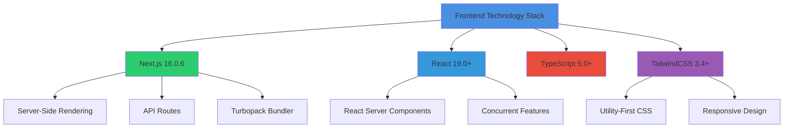

#### Core Libraries

| Library | Version | Purpose |
|---------|---------|---------|
| **Next.js** | 16.0.6 | React framework with SSR |
| **React** | 19.0+ | UI component library |
| **TypeScript** | 5.0+ | Type safety |
| **TailwindCSS** | 3.4+ | Styling framework |
| **React Hook Form** | 7.45+ | Form management |
| **Zustand** | 4.4+ | State management |
| **Recharts** | 3.5+ | Data visualization |
| **@supabase/supabase-js** | 2.84.0 | Database client |

### Backend Stack

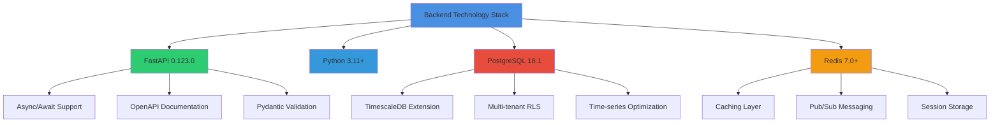

#### Core Dependencies

| Package | Version | Purpose |
|---------|---------|---------|
| **FastAPI** | 0.123.0 | Web framework |
| **Uvicorn** | 0.32+ | ASGI server |
| **Pydantic** | 2.5+ | Data validation |
| **SQLAlchemy** | 2.0+ | ORM |
| **asyncpg** | 0.29+ | Async PostgreSQL driver |
| **OpenAI** | 1.24.1 | AI integration |
| **paho-mqtt** | 1.6+ | MQTT protocol |

### Infrastructure Stack

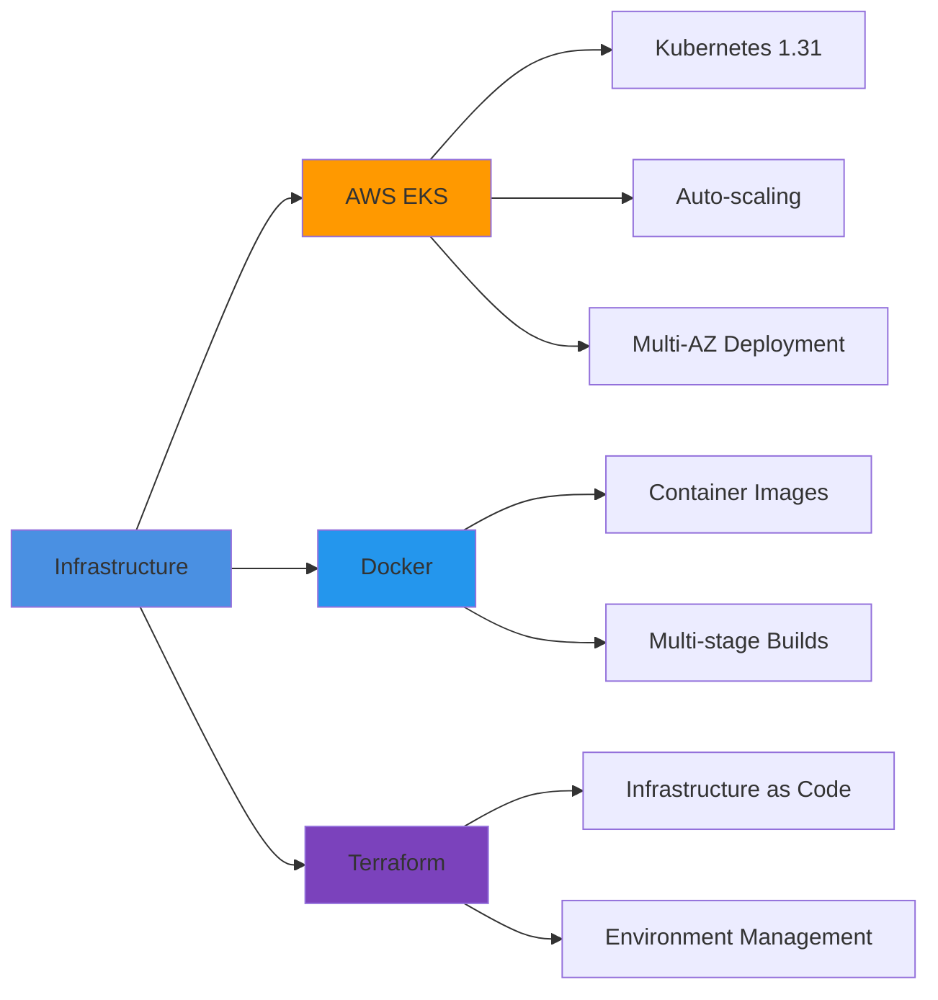

---

## 3. System Architecture

### High-Level Architecture

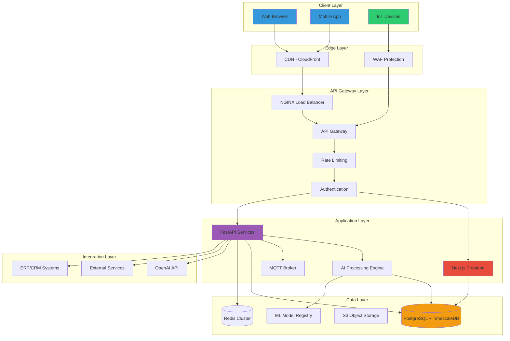

### Microservices Architecture

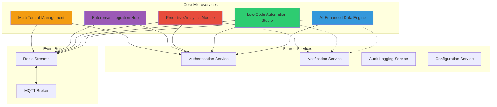

---

## 4. Core Components

### Component Breakdown

```mermaid
graph TD
    subgraph "F-001: AI-Enhanced Data Engine"
        F1A[Data Ingestion Service]
        F1B[Real-time Validation]
        F1C[Anomaly Detection]
        F1D[Data Correlation]
    end
    
    subgraph "F-002: Low-Code Automation Studio"
        F2A[Visual Workflow Designer]
        F2B[Workflow Execution Engine]
        F2C[Template Library]
        F2D[Version Control]
    end
    
    subgraph "F-003: Predictive Analytics Module"
        F3A[ML Model Training]
        F3B[Real-time Inference]
        F3C[Model Versioning]
        F3D[Performance Monitoring]
    end
    
    subgraph "F-004: Enterprise Integration Hub"
        F4A[API Gateway]
        F4B[Protocol Adapters]
        F4C[Data Transformation]
        F4D[Webhook Management]
    end
    
    subgraph "F-005: Multi-Tenant Management"
        F5A[Tenant Provisioning]
        F5B[RBAC System]
        F5C[Resource Isolation]
        F5D[Billing & Usage]
    end
    
    F1A --> F1B
    F1B --> F1C
    F1C --> F1D
    
    F2A --> F2B
    F2B --> F2C
    
    F3A --> F3B
    F3B --> F3C
    F3C --> F3D
    
    F4A --> F4B
    F4B --> F4C
    
    F5A --> F5B
    F5B --> F5C
    F5C --> F5D
```

### Component Dependencies

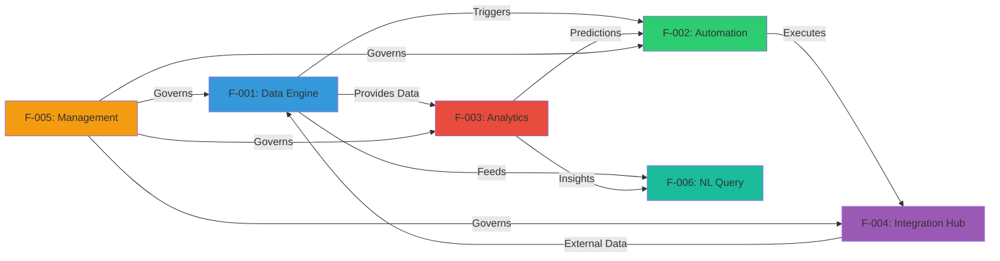

---

## 5. Database Architecture

### Entity Relationship Diagram

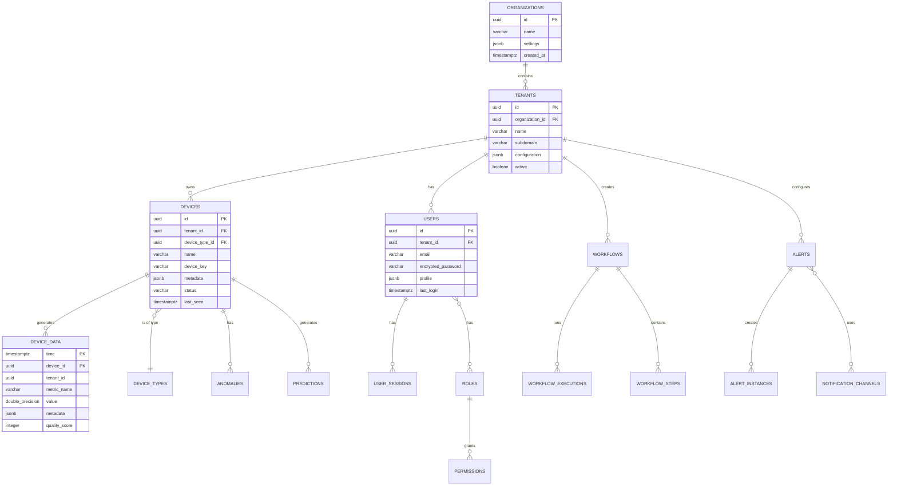

### Database Schema Structure

```sql
-- Multi-tenant foundation
CREATE TABLE tenants (
    id UUID PRIMARY KEY DEFAULT gen_random_uuid(),
    organization_id UUID NOT NULL REFERENCES organizations(id),
    name VARCHAR(255) NOT NULL,
    subdomain VARCHAR(100) UNIQUE NOT NULL,
    configuration JSONB DEFAULT '{}',
    active BOOLEAN DEFAULT true,
    created_at TIMESTAMPTZ DEFAULT NOW(),
    updated_at TIMESTAMPTZ DEFAULT NOW()
);

-- Enable Row Level Security
ALTER TABLE tenants ENABLE ROW LEVEL SECURITY;

-- Time-series data with TimescaleDB
CREATE TABLE device_data (
    time TIMESTAMPTZ NOT NULL,
    device_id UUID NOT NULL,
    tenant_id UUID NOT NULL,
    metric_name VARCHAR(100) NOT NULL,
    value DOUBLE PRECISION,
    metadata JSONB DEFAULT '{}',
    quality_score INTEGER DEFAULT 100,
    CONSTRAINT device_data_tenant_fk FOREIGN KEY (tenant_id) REFERENCES tenants(id)
);

-- Convert to hypertable
SELECT create_hypertable('device_data', 'time', 'tenant_id', number_partitions => 4);

-- Indexes for performance
CREATE INDEX idx_device_data_device_time ON device_data (device_id, time DESC);
CREATE INDEX idx_device_data_tenant_time ON device_data (tenant_id, time DESC);
CREATE INDEX idx_device_metadata_gin ON devices USING GIN (metadata);
```

---

## 6. API Specifications

### API Architecture

```mermaid
graph TB
    subgraph "API Gateway Layer"
        AG1[NGINX Load Balancer]
        AG2[Rate Limiter]
        AG3[Authentication Middleware]
        AG4[Request Router]
    end
    
    subgraph "REST API Endpoints"
        R1[/api/v1/devices]
        R2[/api/v1/data]
        R3[/api/v1/analytics]
        R4[/api/v1/workflows]
        R5[/api/v1/users]
    end
    
    subgraph "WebSocket Endpoints"
        W1[/ws/device-data]
        W2[/ws/alerts]
        W3[/ws/dashboard]
    end
    
    subgraph "GraphQL Endpoint"
        G1[/graphql]
    end
    
    AG1 --> AG2
    AG2 --> AG3
    AG3 --> AG4
    
    AG4 --> R1
    AG4 --> R2
    AG4 --> R3
    AG4 --> R4
    AG4 --> R5
    AG4 --> W1
    AG4 --> W2
    AG4 --> W3
    AG4 --> G1
    
    style AG1 fill:#3498db
    style R1 fill:#2ecc71
    style W1 fill:#e74c3c
    style G1 fill:#9b59b6
```

### Core API Endpoints

#### Device Management API

```typescript
// GET /api/v1/devices
interface GetDevicesRequest {
  tenant_id: string;
  page?: number;
  limit?: number;
  status?: 'online' | 'offline' | 'warning' | 'error';
  search?: string;
}

interface GetDevicesResponse {
  devices: Device[];
  pagination: {
    total: number;
    page: number;
    limit: number;
    total_pages: number;
  };
}

// POST /api/v1/devices
interface CreateDeviceRequest {
  name: string;
  type: string;
  location?: GeoLocation;
  metadata?: Record<string, any>;
  configuration?: Record<string, any>;
}

interface CreateDeviceResponse {
  device: Device;
  credentials: {
    device_id: string;
    device_key: string;
    mqtt_endpoint: string;
  };
}

// GET /api/v1/devices/{device_id}/data
interface GetDeviceDataRequest {
  device_id: string;
  start_time: string; // ISO 8601
  end_time: string;   // ISO 8601
  metrics?: string[]; // Optional filter
  aggregation?: 'none' | '1m' | '5m' | '1h' | '1d';
}

interface GetDeviceDataResponse {
  device_id: string;
  data: SensorReading[];
  aggregation: string;
  time_range: {
    start: string;
    end: string;
  };
}
```

#### Analytics API

```typescript
// POST /api/v1/analytics/predict
interface PredictRequest {
  device_id: string;
  prediction_type: 'failure' | 'anomaly' | 'trend';
  horizon?: number; // Hours ahead
  confidence_threshold?: number;
}

interface PredictResponse {
  device_id: string;
  prediction: {
    type: string;
    probability: number;
    confidence: number;
    time_to_event?: number; // Hours
    recommended_actions: string[];
  };
  model_info: {
    version: string;
    last_trained: string;
    accuracy: number;
  };
}

// GET /api/v1/analytics/insights
interface GetInsightsRequest {
  tenant_id: string;
  time_range: {
    start: string;
    end: string;
  };
  insight_types?: string[];
}

interface GetInsightsResponse {
  insights: Insight[];
  summary: {
    total_devices: number;
    active_alerts: number;
    predictions_generated: number;
  };
}
```

#### Workflow Automation API

```typescript
// POST /api/v1/workflows
interface CreateWorkflowRequest {
  name: string;
  description?: string;
  triggers: TriggerConfig[];
  actions: ActionConfig[];
  conditions?: ConditionConfig[];
  schedule?: ScheduleConfig;
}

interface CreateWorkflowResponse {
  workflow: Workflow;
  validation: {
    valid: boolean;
    warnings?: string[];
    errors?: string[];
  };
}

// POST /api/v1/workflows/{workflow_id}/execute
interface ExecuteWorkflowRequest {
  workflow_id: string;
  input_data?: Record<string, any>;
  dry_run?: boolean;
}

interface ExecuteWorkflowResponse {
  execution_id: string;
  status: 'pending' | 'running' | 'completed' | 'failed';
  started_at: string;
  completed_at?: string;
  results?: Record<string, any>;
  errors?: string[];
}
```

### WebSocket Protocol

```typescript
// WebSocket Connection
interface WebSocketMessage {
  type: 'subscribe' | 'unsubscribe' | 'data' | 'error';
  channel: string;
  payload: any;
  timestamp: string;
}

// Real-time Device Data
interface DeviceDataMessage {
  type: 'data';
  channel: 'device-data';
  payload: {
    device_id: string;
    timestamp: string;
    metrics: {
      [key: string]: number;
    };
    metadata?: Record<string, any>;
  };
}

// Alert Notifications
interface AlertMessage {
  type: 'alert';
  channel: 'alerts';
  payload: {
    alert_id: string;
    device_id: string;
    severity: 'info' | 'warning' | 'critical';
    message: string;
    timestamp: string;
    acknowledged: boolean;
  };
}
```

---

## 7. Authentication & Authorization

### Authentication Flow

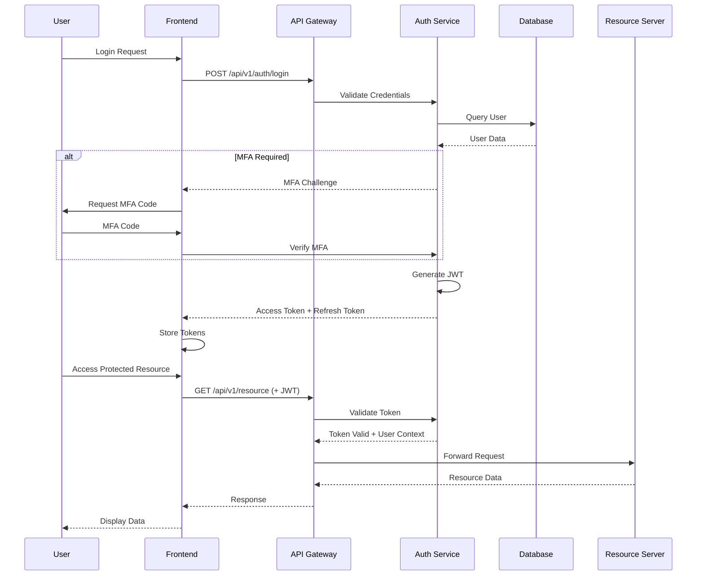

### Authorization Model

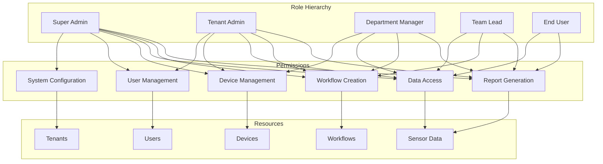

### JWT Token Structure

```typescript
interface JWTPayload {
  // Standard claims
  sub: string;        // User ID
  exp: number;        // Expiration time
  iat: number;        // Issued at
  iss: string;        // Issuer
  
  // Custom claims
  tenant_id: string;
  organization_id: string;
  roles: string[];
  permissions: string[];
  session_id: string;
  mfa_verified: boolean;
}

interface RefreshToken {
  sub: string;
  exp: number;
  iat: number;
  token_type: 'refresh';
  session_id: string;
}
```

---

## 8. Frontend Architecture

### Application Structure

```
src/
├── app/                          # Next.js App Router
│   ├── (auth)/                   # Authentication routes
│   │   ├── login/
│   │   ├── register/
│   │   └── forgot-password/
│   ├── (dashboard)/              # Main application
│   │   ├── devices/
│   │   ├── analytics/
│   │   ├── workflows/
│   │   ├── alerts/
│   │   └── settings/
│   ├── api/                      # API routes
│   │   ├── auth/
│   │   ├── devices/
│   │   └── webhooks/
│   ├── layout.tsx
│   └── page.tsx
├── components/                   # Reusable components
│   ├── ui/                       # Base UI components
│   ├── dashboard/                # Dashboard-specific
│   ├── forms/                    # Form components
│   └── charts/                   # Visualization components
├── lib/                          # Utilities and libraries
│   ├── api/                      # API client
│   ├── auth/                     # Authentication utilities
│   ├── hooks/                    # Custom React hooks
│   └── utils/                    # Helper functions
├── store/                        # State management
│   ├── authStore.ts
│   ├── deviceStore.ts
│   └── workflowStore.ts
├── types/                        # TypeScript types
│   ├── api.ts
│   ├── database.ts
│   └── components.ts
└── styles/                       # Global styles
    └── globals.css
```

### Component Hierarchy

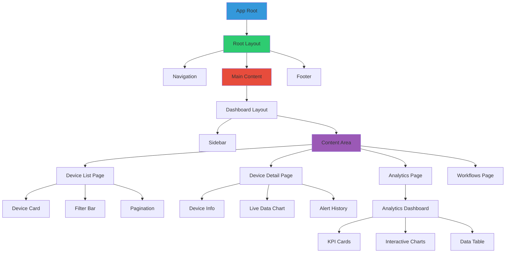

### State Management

```typescript
// Device Store (Zustand)
interface DeviceStore {
  devices: Device[];
  selectedDevice: Device | null;
  loading: boolean;
  error: string | null;
  
  // Actions
  fetchDevices: (tenantId: string) => Promise<void>;
  selectDevice: (deviceId: string) => void;
  updateDevice: (deviceId: string, data: Partial<Device>) => Promise<void>;
  deleteDevice: (deviceId: string) => Promise<void>;
}

// Workflow Store
interface WorkflowStore {
  workflows: Workflow[];
  activeWorkflow: Workflow | null;
  executions: WorkflowExecution[];
  
  // Actions
  createWorkflow: (workflow: CreateWorkflowRequest) => Promise<void>;
  executeWorkflow: (workflowId: string, data?: any) => Promise<void>;
  updateWorkflow: (workflowId: string, updates: Partial<Workflow>) => Promise<void>;
}

// Auth Store
interface AuthStore {
  user: User | null;
  token: string | null;
  isAuthenticated: boolean;
  
  // Actions
  login: (email: string, password: string) => Promise<void>;
  logout: () => void;
  refreshToken: () => Promise<void>;
  updateProfile: (data: Partial<User>) => Promise<void>;
}
```

### Real-Time Data Handling

```typescript
// WebSocket Hook
function useDeviceData(deviceId: string) {
  const [data, setData] = useState<SensorReading[]>([]);
  const [isConnected, setIsConnected] = useState(false);
  
  useEffect(() => {
    const ws = new WebSocket(`wss://api.iotlinker.com/ws/device-data`);
    
    ws.onopen = () => {
      setIsConnected(true);
      ws.send(JSON.stringify({
        type: 'subscribe',
        channel: 'device-data',
        payload: { device_id: deviceId }
      }));
    };
    
    ws.onmessage = (event) => {
      const message = JSON.parse(event.data);
      if (message.type === 'data') {
        setData(prev => [...prev.slice(-100), message.payload]);
      }
    };
    
    ws.onclose = () => setIsConnected(false);
    
    return () => {
      ws.close();
    };
  }, [deviceId]);
  
  return { data, isConnected };
}
```

---

## 9. Data Flow Diagrams

### IoT Device Data Flow

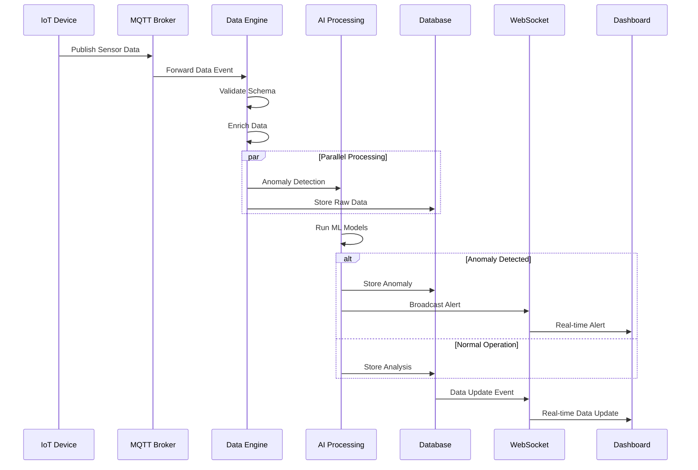

### Workflow Execution Flow

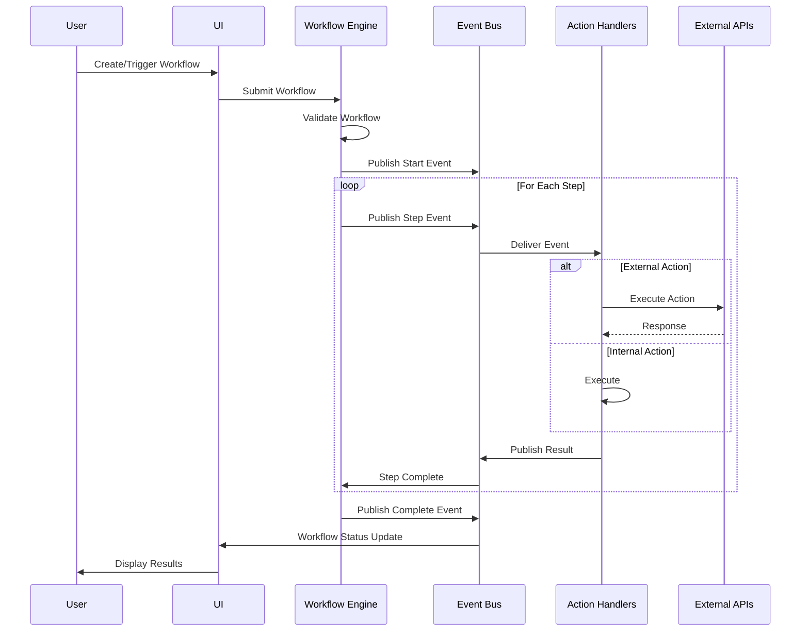

### Authentication Flow

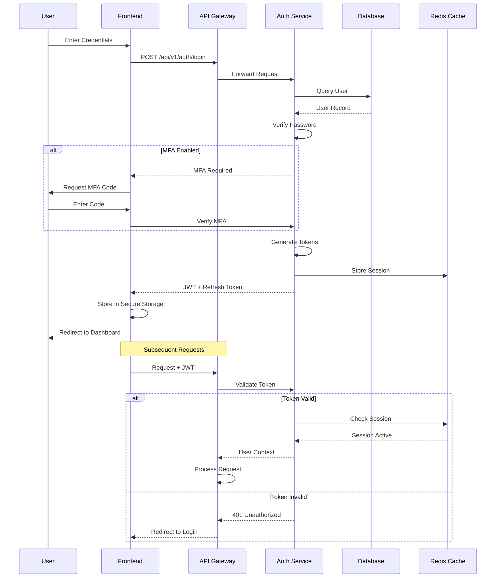

---

## 10. Development Phases

### Phase 1: Foundation (Weeks 1-4)

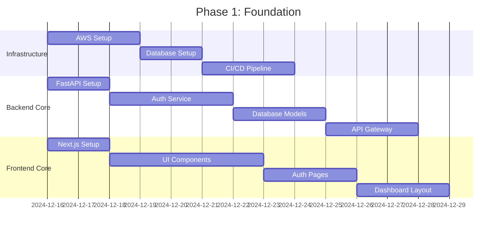

#### Deliverables
- [ ] AWS infrastructure provisioned (EKS, RDS, ElastiCache)
- [ ] PostgreSQL database with TimescaleDB extension
- [ ] FastAPI backend with authentication
- [ ] Next.js frontend with authentication pages
- [ ] CI/CD pipeline configured
- [ ] Basic monitoring and logging

### Phase 2: Core Features (Weeks 5-10)

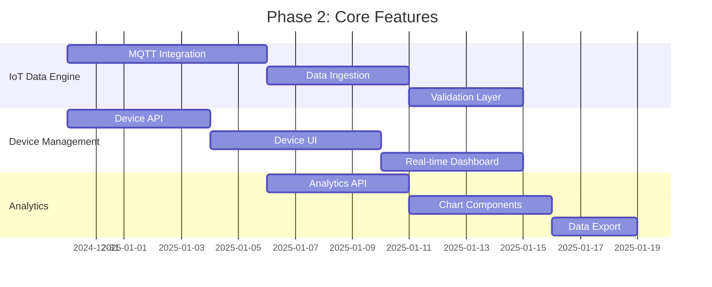

#### Deliverables
- [ ] F-001: AI-Enhanced Data Engine (MVP)
  - MQTT broker integration
  - Real-time data ingestion (10K+ messages/sec)
  - Data validation and enrichment
  - Time-series data storage
- [ ] Device Management Interface
  - Device registration and provisioning
  - Device list and detail views
  - Real-time device status
  - Device configuration
- [ ] Analytics Dashboard
  - Interactive charts (Recharts)
  - Time-range selection
  - Data filtering and aggregation
  - Export functionality

### Phase 3: AI & Automation (Weeks 11-16)

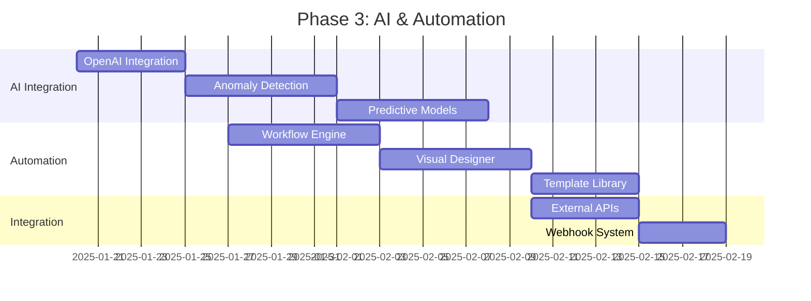

#### Deliverables
- [ ] F-003: Predictive Analytics Module
  - ML model training pipeline
  - Real-time inference engine
  - Anomaly detection (>85% accuracy)
  - Predictive maintenance alerts
- [ ] F-002: Low-Code Automation Studio
  - Visual workflow designer
  - Workflow execution engine
  - 50+ pre-built templates
  - Conditional logic and loops
- [ ] F-004: Enterprise Integration Hub
  - REST API connectors
  - Webhook management
  - Data transformation engine
  - OAuth integration

### Phase 4: Enterprise Features (Weeks 17-22)

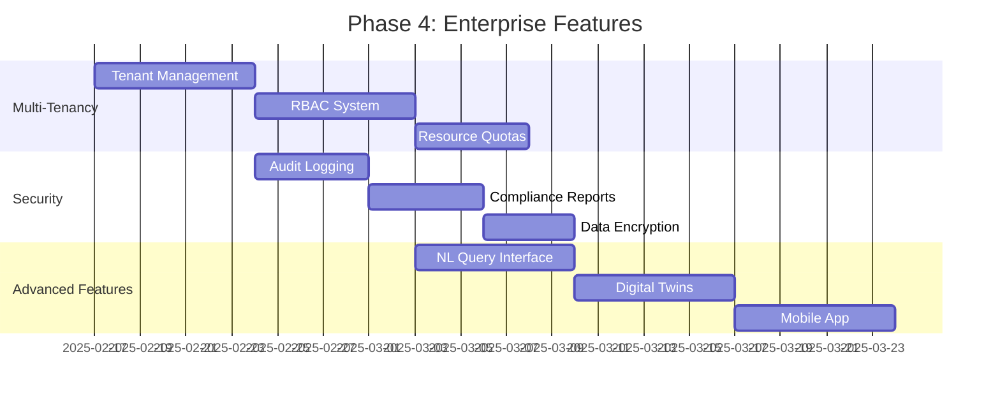

#### Deliverables
- [ ] F-005: Multi-Tenant Management Console
  - Tenant provisioning and management
  - RBAC with hierarchical roles
  - Resource isolation and quotas
  - Billing and usage tracking
- [ ] Security & Compliance
  - Comprehensive audit logging
  - SOC 2 compliance reports
  - Data encryption (at rest and in transit)
  - GDPR compliance tools
- [ ] F-006: Natural Language Query Interface
  - OpenAI integration for NL queries
  - Contextual data understanding
  - Query history and suggestions

### Phase 5: Testing & Optimization (Weeks 23-26)

#### Deliverables
- [ ] Performance Testing
  - Load testing (100K+ concurrent connections)
  - Stress testing
  - Performance optimization
  - Caching implementation
- [ ] Security Testing
  - Penetration testing
  - Vulnerability scanning
  - Security audit
  - Compliance validation
- [ ] User Acceptance Testing
  - Beta user testing
  - Bug fixes
  - UI/UX refinements
  - Documentation

---

## 11. Quality Assurance

### Testing Strategy

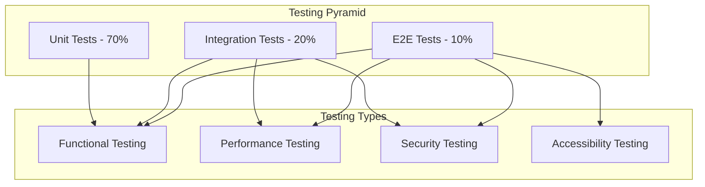

### Test Coverage Requirements

| Test Type | Coverage Target | Tool | Frequency |
|-----------|----------------|------|-----------|
| **Unit Tests** | >90% | pytest, Jest | Every commit |
| **Integration Tests** | >80% | pytest, Cypress | Daily |
| **E2E Tests** | >70% | Cypress | Pre-release |
| **API Tests** | 100% endpoints | FastAPI TestClient | Every commit |
| **Performance Tests** | All critical paths | k6, Locust | Weekly |
| **Security Scans** | All dependencies | Snyk, Trivy | Daily |

### CI/CD Quality Gates

```mermaid
graph LR
    A[Code Commit] --> B{Linting}
    B -->|Pass| C{Unit Tests}
    B -->|Fail| Z[Block Merge]
    C -->|Pass| D{Coverage}
    C -->|Fail| Z
    D -->|>90%| E{Security Scan}
    D -->|<90%| Z
    E -->|Pass| F{Integration Tests}
    E -->|Fail| Z
    F -->|Pass| G[Merge Approved]
    F -->|Fail| Z
    
    style A fill:#3498db
    style G fill:#2ecc71
    style Z fill:#e74c3c
```

---

## 12. Deployment Strategy

### Environment Architecture

```mermaid
graph TB
    subgraph "Development Environment"
        D1[Local Docker]
        D2[Feature Branches]
        D3[Dev Database]
    end
    
    subgraph "Staging Environment"
        S1[Kubernetes Staging]
        S2[Staging Database]
        S3[Mock External Services]
    end
    
    subgraph "Production Environment"
        P1[Kubernetes Production]
        P2[Multi-AZ Database]
        P3[External Integrations]
        P4[CDN]
    end
    
    D1 --> D2
    D2 --> S1
    S1 --> S2
    S1 --> S3
    
    S1 -->|Manual Approval| P1
    P1 --> P2
    P1 --> P3
    P1 --> P4
    
    style D1 fill:#3498db
    style S1 fill:#f39c12
    style P1 fill:#2ecc71
```

### Deployment Pipeline

```mermaid
graph LR
    A[Git Push] --> B[GitHub Actions]
    B --> C[Build & Test]
    C --> D{Tests Pass?}
    D -->|Yes| E[Build Container]
    D -->|No| Z[Fail]
    E --> F[Security Scan]
    F --> G{Scan Pass?}
    G -->|Yes| H[Push to ECR]
    G -->|No| Z
    H --> I{Environment?}
    I -->|Dev| J[Auto Deploy Dev]
    I -->|Staging| K[Auto Deploy Staging]
    I -->|Production| L[Manual Approval]
    L --> M[Blue-Green Deploy]
    M --> N[Health Checks]
    N --> O{Healthy?}
    O -->|Yes| P[Switch Traffic]
    O -->|No| Q[Rollback]
    P --> R[Monitor]
    
    style A fill:#3498db
    style P fill:#2ecc71
    style Z fill:#e74c3c
    style Q fill:#e74c3c
```

### Rollback Procedure

```mermaid
sequenceDiagram
    participant Monitoring
    participant Ops Team
    participant CI/CD
    participant Kubernetes
    participant Database
    
    Monitoring->>Monitoring: Detect Issue
    Monitoring->>Ops Team: Alert
    
    alt Automated Rollback (Error Rate >5%)
        Monitoring->>CI/CD: Trigger Rollback
    else Manual Rollback
        Ops Team->>CI/CD: Initiate Rollback
    end
    
    CI/CD->>Kubernetes: Switch to Previous Version
    Kubernetes->>Kubernetes: Update Deployments
    
    alt Database Changes Present
        CI/CD->>Database: Run Rollback Migration
    end
    
    Kubernetes->>Monitoring: New Deployment Active
    Monitoring->>Monitoring: Verify Health
    Monitoring->>Ops Team: Rollback Complete
```

---

## Development Team Structure

### Recommended Team Composition

```mermaid
graph TD
    PM[Product Manager] --> TL[Tech Lead]
    TL --> BE[Backend Team]
    TL --> FE[Frontend Team]
    TL --> DevOps[DevOps Engineer]
    TL --> QA[QA Engineer]
    
    BE --> BE1[Senior Backend Dev]
    BE --> BE2[Backend Dev]
    
    FE --> FE1[Senior Frontend Dev]
    FE --> FE2[Frontend Dev]
    
    TL --> UX[UX/UI Designer]
    
    style PM fill:#3498db
    style TL fill:#2ecc71
    style BE fill:#e74c3c
    style FE fill:#9b59b6
```

### Roles & Responsibilities

| Role | Count | Key Responsibilities |
|------|-------|---------------------|
| **Product Manager** | 1 | Requirements, roadmap, stakeholder management |
| **Tech Lead** | 1 | Architecture, technical decisions, code review |
| **Senior Backend Dev** | 1 | FastAPI services, database design, API development |
| **Backend Developer** | 1-2 | Feature implementation, testing, documentation |
| **Senior Frontend Dev** | 1 | Next.js architecture, UI components, state management |
| **Frontend Developer** | 1-2 | Component development, styling, integration |
| **DevOps Engineer** | 1 | CI/CD, infrastructure, monitoring, deployment |
| **QA Engineer** | 1 | Test strategy, automation, quality gates |
| **UX/UI Designer** | 1 | User research, wireframes, visual design |

---

## Development Standards

### Code Style Guidelines

#### Python (Backend)
```python
# Use Black formatter with line length 100
# Type hints required for all functions
# Docstrings required for all public methods

from typing import Optional, List
from pydantic import BaseModel

class DeviceService:
    """Service for managing IoT devices."""
    
    async def get_device(
        self, 
        device_id: str, 
        tenant_id: str
    ) -> Optional[Device]:
        """
        Retrieve device by ID.
        
        Args:
            device_id: Unique device identifier
            tenant_id: Tenant identifier for access control
            
        Returns:
            Device object if found, None otherwise
        """
        # Implementation
        pass
```

#### TypeScript (Frontend)
```typescript
// Use ESLint + Prettier
// Strict mode enabled
// Functional components preferred

import { FC } from 'react';

interface DeviceCardProps {
  device: Device;
  onSelect: (deviceId: string) => void;
}

export const DeviceCard: FC<DeviceCardProps> = ({ device, onSelect }) => {
  return (
    <div className="rounded-lg border p-4">
      <h3 className="text-lg font-semibold">{device.name}</h3>
      <button onClick={() => onSelect(device.id)}>
        View Details
      </button>
    </div>
  );
};
```

### Git Workflow

```mermaid
gitGraph
    commit id: "Initial commit"
    branch develop
    checkout develop
    commit id: "Setup project"
    branch feature/device-management
    checkout feature/device-management
    commit id: "Add device API"
    commit id: "Add device UI"
    checkout develop
    merge feature/device-management
    branch feature/analytics
    checkout feature/analytics
    commit id: "Add analytics API"
    commit id: "Add charts"
    checkout develop
    merge feature/analytics
    checkout main
    merge develop tag: "v1.0.0"
```

### Commit Message Format

```
<type>(<scope>): <subject>

<body>

<footer>
```

**Types:**
- `feat`: New feature
- `fix`: Bug fix
- `docs`: Documentation changes
- `style`: Code style changes (formatting)
- `refactor`: Code refactoring
- `test`: Adding or updating tests
- `chore`: Maintenance tasks

**Example:**
```
feat(devices): add real-time device monitoring

Implemented WebSocket connection for live device data streaming.
Added real-time chart updates using Recharts.

Closes #123
```

---

## Performance Requirements

### Response Time Targets

| Operation | Target | Maximum |
|-----------|--------|---------|
| **Page Load** | <2s | <3s |
| **API Response** | <50ms (95th) | <100ms (99th) |
| **Database Query** | <10ms | <50ms |
| **Real-time Update** | <100ms | <500ms |
| **Workflow Execution** | <2s | <5s |

### Scalability Targets

| Metric | Initial | Year 1 | Year 3 |
|--------|---------|--------|--------|
| **Concurrent Devices** | 10K | 100K | 1M+ |
| **Concurrent Users** | 100 | 1K | 10K+ |
| **Messages/Second** | 10K | 50K | 100K+ |
| **Data Storage** | 100GB | 1TB | 10TB+ |

---

## Security Requirements

### Security Checklist

- [ ] **Authentication**
  - [ ] Multi-factor authentication (MFA)
  - [ ] Session management with secure tokens
  - [ ] Password complexity requirements
  - [ ] Account lockout after failed attempts

- [ ] **Authorization**
  - [ ] Role-based access control (RBAC)
  - [ ] Row-level security (RLS)
  - [ ] API endpoint authorization
  - [ ] Resource-level permissions

- [ ] **Data Protection**
  - [ ] TLS 1.3 for all communications
  - [ ] AES-256 encryption at rest
  - [ ] Database encryption
  - [ ] Secure key management (AWS KMS)

- [ ] **Security Monitoring**
  - [ ] Audit logging
  - [ ] Intrusion detection
  - [ ] Vulnerability scanning
  - [ ] Security incident response plan

- [ ] **Compliance**
  - [ ] SOC 2 Type II
  - [ ] GDPR compliance
  - [ ] HIPAA compliance (if applicable)
  - [ ] Regular security audits

---

## Monitoring & Observability

### Monitoring Stack

```mermaid
graph TB
    subgraph "Data Collection"
        DC1[OpenTelemetry Collector]
        DC2[Prometheus Exporters]
        DC3[Application Logs]
    end
    
    subgraph "Storage"
        S1[Prometheus]
        S2[Elasticsearch]
        S3[S3 Archive]
    end
    
    subgraph "Visualization"
        V1[Grafana Dashboards]
        V2[Kibana]
        V3[Custom Dashboards]
    end
    
    subgraph "Alerting"
        A1[AlertManager]
        A2[PagerDuty]
        A3[Slack]
    end
    
    DC1 --> S1
    DC2 --> S1
    DC3 --> S2
    
    S1 --> V1
    S2 --> V2
    S1 --> V3
    
    S1 --> A1
    A1 --> A2
    A1 --> A3
```

### Key Metrics to Monitor

| Category | Metrics | Alert Threshold |
|----------|---------|-----------------|
| **Application** | Response time, error rate, throughput | >100ms, >1%, <1000 RPS |
| **Infrastructure** | CPU, memory, disk, network | >80%, >85%, >90%, >80% |
| **Database** | Query time, connections, replication lag | >50ms, >80%, >5s |
| **Business** | Active devices, data ingestion rate, users | Custom thresholds |

---

## Documentation Requirements

### Technical Documentation

- [ ] **Architecture Documentation**
  - [ ] System architecture diagrams
  - [ ] Component interaction diagrams
  - [ ] Database schema documentation
  - [ ] API specifications (OpenAPI)

- [ ] **Development Documentation**
  - [ ] Setup guides (local, staging, production)
  - [ ] Code style guidelines
  - [ ] Contributing guidelines
  - [ ] Testing documentation

- [ ] **Operations Documentation**
  - [ ] Deployment procedures
  - [ ] Monitoring and alerting
  - [ ] Incident response playbooks
  - [ ] Disaster recovery procedures

- [ ] **User Documentation**
  - [ ] User guides
  - [ ] API documentation
  - [ ] Integration guides
  - [ ] FAQ and troubleshooting

---

## Risk Management

### Technical Risks

| Risk | Impact | Probability | Mitigation |
|------|--------|-------------|------------|
| **Scalability Issues** | High | Medium | Load testing, auto-scaling, caching |
| **Data Loss** | Critical | Low | Backups, replication, disaster recovery |
| **Security Breach** | Critical | Medium | Security audits, monitoring, incident response |
| **Integration Failures** | Medium | Medium | Circuit breakers, fallbacks, monitoring |
| **Performance Degradation** | High | Medium | Performance testing, optimization, scaling |

### Contingency Plans

```mermaid
graph TD
    A[Issue Detected] --> B{Severity?}
    B -->|Critical| C[Immediate Response]
    B -->|High| D[4-Hour Response]
    B -->|Medium| E[24-Hour Response]
    B -->|Low| F[Next Sprint]
    
    C --> G[Activate Incident Response]
    G --> H[Assess Impact]
    H --> I{Rollback Needed?}
    I -->|Yes| J[Execute Rollback]
    I -->|No| K[Apply Fix]
    J --> L[Verify Resolution]
    K --> L
    L --> M[Post-Mortem]
    
    style A fill:#3498db
    style C fill:#e74c3c
    style M fill:#2ecc71
```

---

## Success Criteria

### Technical Success Metrics

- [ ] **Performance**
  - [ ] <100ms API response time (95th percentile)
  - [ ] <2s page load time
  - [ ] 99.9% uptime
  - [ ] Support 100K+ concurrent connections

- [ ] **Quality**
  - [ ] >90% code coverage
  - [ ] <1% error rate
  - [ ] Zero critical security vulnerabilities
  - [ ] <5 P1 bugs in production

- [ ] **Scalability**
  - [ ] Support 1M+ devices
  - [ ] 100K+ messages/second throughput
  - [ ] Horizontal scaling validated
  - [ ] Multi-region deployment ready

### Business Success Metrics

- [ ] **User Adoption**
  - [ ] 500+ enterprise customers (24 months)
  - [ ] 80% monthly active users
  - [ ] 4.5/5 user satisfaction score

- [ ] **Platform Performance**
  - [ ] 40% reduction in time-to-insight
  - [ ] 60% decrease in IoT deployment complexity
  - [ ] 25% improvement in operational efficiency

- [ ] **Revenue**
  - [ ] $50M ARR (24 months)
  - [ ] $135M ARR (2030)
  - [ ] 300% increase in customer lifetime value

---

## Next Steps

### Immediate Actions (Week 1)

1. **Team Assembly**
   - Recruit development team
   - Assign roles and responsibilities
   - Set up communication channels

2. **Environment Setup**
   - AWS account setup
   - Development environment configuration
   - CI/CD pipeline initialization

3. **Project Planning**
   - Sprint planning
   - Backlog grooming
   - Risk assessment

### Short-term Goals (Month 1)

1. **Infrastructure**
   - AWS infrastructure provisioning
   - Database setup
   - Monitoring and logging

2. **Core Development**
   - Authentication system
   - Basic API endpoints
   - Frontend skeleton

3. **DevOps**
   - CI/CD pipeline
   - Automated testing
   - Deployment automation

---

## Appendix

### Glossary

| Term | Definition |
|------|------------|
| **IoT** | Internet of Things - network of connected physical devices |
| **MQTT** | Message Queuing Telemetry Transport - lightweight messaging protocol |
| **TimescaleDB** | PostgreSQL extension for time-series data |
| **RLS** | Row Level Security - PostgreSQL security feature |
| **RBAC** | Role-Based Access Control |
| **JWT** | JSON Web Token - authentication token standard |
| **WebSocket** | Protocol for real-time bidirectional communication |

### References

- [Next.js Documentation](https://nextjs.org/docs)
- [FastAPI Documentation](https://fastapi.tiangolo.com/)
- [PostgreSQL Documentation](https://www.postgresql.org/docs/)
- [TimescaleDB Documentation](https://docs.timescale.com/)
- [AWS EKS Documentation](https://docs.aws.amazon.com/eks/)
- [Kubernetes Documentation](https://kubernetes.io/docs/)

### Contact Information

- **Project Lead:** [Name]
- **Tech Lead:** [Name]
- **Product Manager:** [Name]
- **DevOps Lead:** [Name]

---

**Document Version:** 1.0  
**Last Updated:** December 13, 2024  
**Status:** Draft - Pending Review

---

## Document Approval

| Role | Name | Signature | Date |
|------|------|-----------|------|
| **Product Manager** | | | |
| **Tech Lead** | | | |
| **Security Lead** | | | |
| **DevOps Lead** | | | |

---

*This document is confidential and proprietary to IoTLinker Enterprise. Unauthorized distribution is prohibited.*